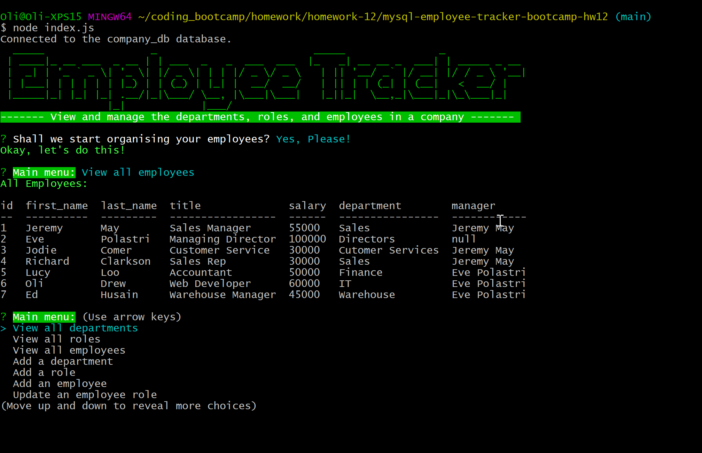

# Employee Tracker

## Description

Terminal application to view and manage the departments, roles, and employees in a company. The application uses NodeJS and the Inquirer package to prompt the user to answer a series of questions and then saves the answers to a MySQL database. Enjoy!

---

## Table of Contents

1. [Installation](#installation)
2. [Usage](#usage)
3. [License](#license)
4. [Contributing](#contributing)
5. [Questions](#questions)

## Installation

- You will need MySQL running
- Git Clone this repository
- Navigate to the directory you cloned it to
- Enter `npm install`
- Run the schema.sql and seeds.sql files in mysql cli to create and populate database.
- To start the program enter: `node index.js`
- Answer the questions!
- Your answers will be stored to the database for you to view and update

## Usage

When the application has started the user is presented with the main menu. The main menu options are view all departments, view all roles, view all employees, add a department, add a role, add an employee, update an employee role, view budgets, and exit.

- View all departments displays a table of all the company departments
- View all roles displays a table all the company roles plus the department name it belongs to.
- View all employees displays a table of all the employees plus their salary taken from the role table and their manager’s name.
- Add a department allows the user to create a new department in the database.
- Add a role allows the user to create a new job role in the database.
- Add an employee allows the user to create a new company employee which is added to the database.
- Update an employee role allows the user to change the role of an employee.
- View budgets allows the user to view the budget utilised based on department or job role.

### Video

A video walkthrough of how to use this application is available here: [Video](https://drive.google.com/file/d/1lwcOoLtF27tyqnO0zKdTc_1P_oJMbIhE/view?usp=sharing)

### Screenshot

## License

This project is licensed under MIT.

## Contributing

- Oliver Drew

## Questions

If you have any questions please contact me via [GitHub](https://github.com/oli-drew) or [Email](mailto:oli-webdev@protonmail.com)
